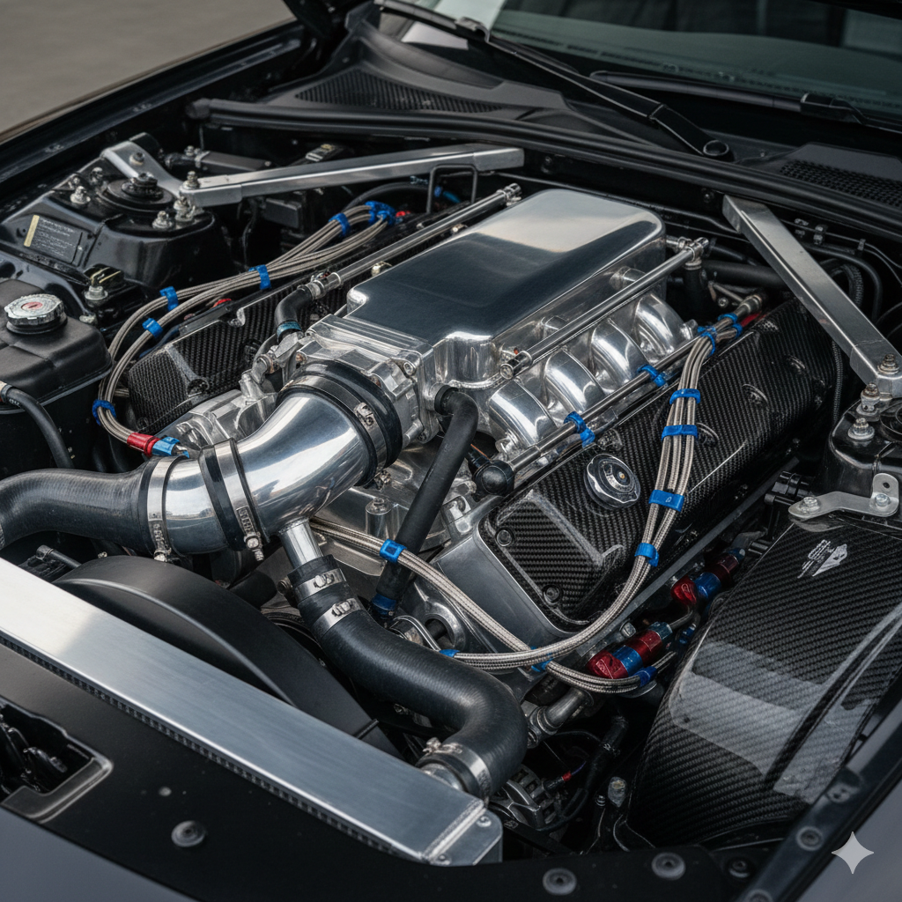
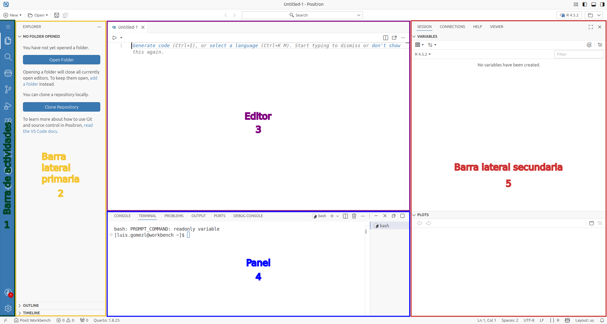
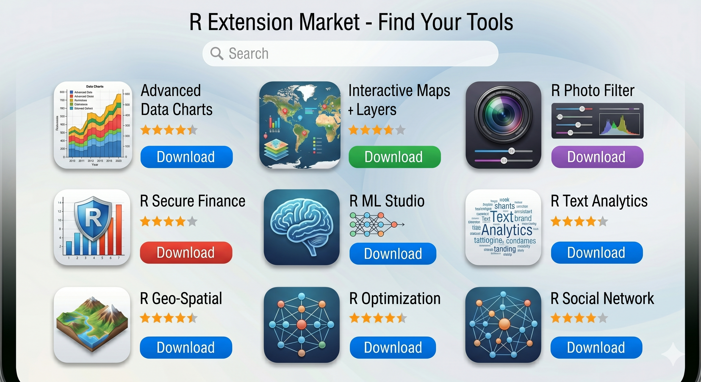

```{r}
#| label: load-packages
library(tidyverse)
```

# Curso R para análisis de datos

## {.smaller .center}

:::: {.columns}

::: {.column width="60%"}
- Instructor: Luis Francisco Gómez López
- Afiliación: 

  - Facultad de Estudios a Distancia
  - Administración de Empresas

- Correo institucional: [](mailto:)
- Celular: 
:::

::: {.column width="40%"}

:::

::::

## {.smaller}

- **Syllabus**

  - [https://luifrancgom.github.io/r-clio-curso-analisis-datos/](https://luifrancgom.github.io/r-clio-curso-analisis-datos/)

- **Encuentros virtuales**

  - Día: Viernes
  - Horario: 13:00 - 16:00
  - Vínculo de ingreso: []()

- **Asistencia**

  - Por direccionamiento del [Centro de Excelencia Profesoral](https://umng.edu.co/centro/excelencia-profesoral/), se requiere como mínimo una asistencia válida del 80\%. 
  
  - Se tomará por defecto el seguimiento automático que realiza Google Meet (nombre, apellido, correo institucional, duración y horas de ingreso y salida).

- **Grabaciones**

  - En YouTube en [Curso R para análisis de datos 2026-2](https://www.youtube.com/playlist?list=PLeM6qo2XF_C8).

## {.smaller}

- **Información general**

  - Introducir a los participantes al uso de [R](https://www.r-project.org/) a través del entorno integrado de desarrollo [Positron](https://positron.posit.co/welcome.html) para realizar análisis de datos y comunicar los resultados utilizando [Quarto](https://quarto.org/).

- **Información específica**

  - Uso de R para análisis de datos utilizando Positron como entorno integrado de desarrollo y Quarto para comunicar resultados con el propósito de tener un flujo de trabajo más [reproducible](https://carpentries-incubator.github.io/reproducible-publications-quarto/01-introduction.html).

  -  Introducir diferentes herramientas utilizando el lenguaje de programación R para conocer cómo visualizar, manipular, organizar, limpiar e importar datos para luego comunicar resultados.


## {.smaller}

```{=html}
<style>
#tbl-topics-course td, #tbl-topics-course th {
    padding: 3px 8px;
    }
</style>
```

- **Contenidos a desarrollar**

::: {style="font-size: 0.8em;"}
| Tema a desarrollar | Sesión | Fecha |
| :--- | :---: | :---: |
| Primeros pasos con R | 1 | 2026-09-04 |
| Visualización de datos | 2 | 2026-09-11 |
| Visualización de datos | 3 | 2026-09-18 |
| Manipulación de datos | 4 | 2026-09-25 |
| Manipulación de datos | 5 | 2026-10-02 |
| Importación de datos | 6 | 2026-10-09 |
| Importación de datos | 7 | 2026-10-16 |
| Organización y limpieza de datos | 8 | 2026-10-23 |
| Organización y limpieza de datos | 9 | 2026-10-30 |
| Programación funcional | 10 | 2026-11-06 |
| Programación funcional | 11 | 2026-11-13 |
| Comunicación con Quarto | 12 | 2026-11-20 |
| Comunicación con Quarto | 13 | 2026-11-27 |

: Temáticas a desarrollar en el curso {#tbl-topics-course .striped .hover}
:::

## {.smaller .nost}

- **Material principal**

  - [@gomez_lopez_r_2026]

    - [HTML](https://luifrancgom.github.io/r-clio/)
    - [PDF](https://luifrancgom.github.io/r-clio/R-para-an%C3%A1lisis-de-datos.pdf)

- **Diagrama de Venn de la ciencia de datos**

![El diagrama de Venn de la ciencia de datos (Basado en [@conway_data_2010] y [@h2oai_intro_2015])](images/data-science-venn-diagram.png){.nostretch #fig-data-science-venn-diagram fig-alt="Diagrama de Venn de tres círculos que define la Ciencia de Datos. Los círculos principales son: Habilidades de programación, Conocimiento en matemáticas y estadística, y Experticia en un campo. En las intersecciones se leen: Modelado de datos, Investigación tradicional, Análisis sin conocimiento estadístico, y en el centro, Ciencia de datos." width=30%}

## 

```{r}
#| label: fig-enrolled
#| fig-cap: "Inscritos en el curso R para análisis de datos por facultad"

enrolled <- read_csv(
  file = "data/enrolled-clean_2026-2.csv"
)

enrolled |>
  count(facultad) |>
  ggplot(
    aes(x = n, y = fct_reorder(.f = facultad, .x = n))
  ) +
  geom_label(
    aes(label = n)
  ) +
  geom_segment(
    aes(x = n - 0.3, xend = 0, yend = facultad)
  ) +
  labs(
    subtitle = "Periodo: 2026-2",
    x = NULL,
    y = NULL
  ) +
  theme(
    axis.text.x = element_blank(),
    axis.ticks.x = element_blank()
  )
```

# Bienvenidos a R

##

::: {#fig-r-positron layout="[[48,-4,48]]"}
{fig-alt="Un motor de un automóvil representando a R como el núcleo de procesamiento de datos."}

{fig-alt="Un tablero de control de un automóvil representando a Positron como la interfaz para controlar el motor."}

Analogía para entender la diferencia entre R y Positron
:::

## {.smaller}

- R

  - [https://cloud.r-project.org/](https://cloud.r-project.org/)

- Positron

  - [https://positron.posit.co/download.html](https://positron.posit.co/download.html)

- Quarto

  - No se requiere instalar donde viene incluido en Positron de 2 formas:

    - Línea de comandos
    - Extensión

::: {.callout-note}
En el curso no se utilizará Posit Workbench donde se realizará una instalación local de R, Positron y por defecto Quarto.
:::

## {.center}

::: {#fig-icono-r-positron layout="[[48,-4,48]]"}
{#fig-r-icon width=26% fig-alt="Ícono del proyecto R"}

{#fig-positron-icon width=20% fig-alt="Ícono del proyecto Positron"}

Íconos de R y Positron en tu computador
:::

## 

{#fig-positron-layout-outline fig-alt="Interfaz de Positron resaltando la barra de actividades, barra lateral primaria, el editor, el panel y la barra lateral secundaria"}

##

- **Configuración recomendada para principiantes**

```json
{
    "workbench.colorTheme": "Default Positron Dark",
    "[r]": {
        "editor.formatOnSave": true,
        "editor.defaultFormatter": "Posit.air-vscode"
    },
    "[quarto]": {
        "editor.formatOnSave": true,
        "editor.defaultFormatter": "quarto.quarto"
    },
    "positron.r.defaultRepositories": "posit-ppm"
}
```

# Flujo de trabajo orientado a proyectos

## {.smaller}

::: {#fig-project-vs-no-project-workflow layout="[[48,-4,48]]"}
{fig-alt="Una mesa de trabajo de carpintería desordenada donde las piezas de madera de una silla y una cama están mezcladas y amontonadas, ilustrando la falta de un flujo de trabajo organizado."}

{fig-alt="Una mesa de trabajo de carpintería organizada donde las piezas de una silla y una cama están separadas en cajas independientes, ilustrando un flujo de trabajo basado en proyectos."}

Analogía para entender la importancia de adoptar un flujo de trabajo orientado a proyectos
:::

## {.smaller}

```{css}
.reveal kbd {
  display: inline-block;
  font-size: 0.7em;
  padding: 0.1em 0.3em;
  border: 1px solid #ccc;
  border-radius: 3px;
  vertical-align: middle;
  }
```

- **Flujo de trabajo por proyectos en Positron para R**

  - Para generar un proyecto de R en Positron, utiliza la combinación de teclas  para desplegar la paleta de comandos y escribe: **Workspaces: New Folder from Template...**. 
  
  - Luego, podrás presionar esta opción y elegir a continuación **R project** para realizar las configuraciones respectivas de tu proyecto.
  
  - Primero, deberás definir el nombre de la carpeta donde estará tu proyecto y la ubicación dentro de tu computador o equipo. En el caso del nombre, para que sigas el contenido del libro te recomendamos utilizar `r-analisis-datos`.

## {.smaller}

- **¿Cómo nombrar archivos y carpetas?**

  - Legible por máquinas

    - No: `Versión tesis   final Mayo 24 definitiva.pdf`
    - Si: `2026-05-24_tesis_v-5.pdf`

  - Legible por humanos:

    - No: `primera clase curso R.R`
    - Si: `002_script_bienvenidos-a-r.R`

  - Compatible con el ordenamiento por defecto

    - No:\
      `Clase 10_script_verbos-de-dos-tablas.R`\
      `Clase 2_script_bienvenidos-a-r.R`

    - Si:\
      `002_script_bienvenidos-a-r.R`\
      `010_script_verbos-de-dos-tablas.R`

# Paquetes de R

## {.smaller}

- **¿Qué son los paquetes en R?**

  - Elementos de un paquete: funciones, documentación, datos de muestra

::: {#fig-base-vs-extend-packages layout="[[48,-4,48]]"}
{fig-alt="Ilustración de un celular con aplicaciones básicas como calculadora y calendario, representando los paquetes que R incluye por defecto."}

{fig-alt="Interfaz de una tienda de aplicaciones digitales con diversos íconos de herramientas especializadas, simbolizando paquetes no instalados por defecto en R que extienden su funcionalidad base."}

Analogía para entender la diferencia entre paquetes que vienen incorporados por defecto en R y aquellos que se pueden instalar para extender su funcionalidad base.
:::

##

- **Instalación de paquetes**

  ```r
  install.packages("tidyverse")
  ```

- **Carga de paquetes**

  ```r
  library(tidyverse)
  ```
  \
  ```r
  ── Attaching core tidyverse packages ── tidyverse 2.0.0 ──
  ✔ dplyr     1.2.0     ✔ readr     2.2.0
  ✔ forcats   1.0.1     ✔ stringr   1.6.0
  ✔ ggplot2   4.0.2     ✔ tibble    3.3.1
  ✔ lubridate 1.9.5     ✔ tidyr     1.3.2
  ✔ purrr     1.2.1     
  ── Conflicts ──────────────────── tidyverse_conflicts() ──
  ✖ dplyr::filter() masks stats::filter()
  ✖ dplyr::lag()    masks stats::lag()
  ℹ Use the conflicted package to force all conflicts 
  to become errors
  ```

##

- **Uso de paquetes**

  ```r
  # Cargar paquetes ----
  library(tidyverse)

  # Explorar el conjunto de datos mpg ----
  mpg

  # Documentación del conjunto de datos mpg ----
  ?mpg

  # Uso del explorador de datos ----
  View(mpg)

  # "Vistazo" del conjunto de datos ----
  glimpse(mpg)

  # Extracción de columnas ----
  mpg$manufacturer
  pull(mpg, manufacturer)
  ```

# ¿Cómo escribir código en R?

## {.smaller}

- **Operaciones aritméticas**

  - Administración de Empresas: $ 4,389,000 COP
  - Administración de Riesgos, Seguridad y Salud en el Trabajo: $ 4,896,000 COP
  - Contaduría Pública: $ 4,135,000 COP
  - Ingeniería Civil: $ 4,940,000 COP
  - Ingeniería Industrial: $ 5,638,000 COP
  - Ingeniería Informática: $ 4,661,000 COP
  - Relaciones Internacionales y Estudios Políticos: $ 6,238,000 COP

  ```r
  # Costo promedio de matrícula ----
  (4389000 +
    4896000 +
    4135000 +
    4940000 +
    5638000 +
    4661000 +
    6238000) /
    7
  ```

## {.smaller}

- **Vectores atómicos en R**

  ```r
  # Vector atómico ----
  costo_matricula <- c(
    4389000,
    4896000,
    4135000,
    4940000,
    5638000,
    4661000,
    6238000
  )

  # Cálculo de la media muestral ----
  media_costo_matricula <- mean(costo_matricula)

  # Cálculo de la varianza muestral ----
  varianza_costo_matricula <- sum(
  (costo_matricula - media_costo_matricula)^2
  ) /
    (7 - 1)

  # Cálculo de la desviación estandar muestral ----
  desv_estandar_costo_matricula <- sqrt(
    varianza_costo_matricula
  )
  ```

## {.smaller}

- **Mensajes**

  ```r
  ── Attaching core tidyverse packages ── tidyverse 2.0.0 ──
  ✔ dplyr     1.2.0     ✔ readr     2.2.0
  ✔ forcats   1.0.1     ✔ stringr   1.6.0
  ✔ ggplot2   4.0.2     ✔ tibble    3.3.1
  ✔ lubridate 1.9.5     ✔ tidyr     1.3.2
  ✔ purrr     1.2.1
  
      
  ── Conflicts ──────────────────── tidyverse_conflicts() ──
  ✖ dplyr::filter() masks stats::filter()
  ✖ dplyr::lag()    masks stats::lag()
  ℹ Use the conflicted package to force all conflicts 
  to become errors
  ```
- **Advertencias**

  ```r
  aumento_costo_matricula <- c(
    100000,
    130000,
    250000,
    145000,
    210000,
    94000
  )

  costo_matricula + aumento_costo_matricula
  ```

## {.smaller}

- **Errores**

  ```r
  aumento_costo_matricula <- c(
    100000,
    130000,
    250000,
    145000,
    210000,
    94000
    45000
  )

  costo_matricula + aumento_costo_matricula
  ```
  \
  ```{.r code-line-numbers="7"}
  aumento_costo_matricula <- c(
    100000,
    130000,
    250000,
    145000,
    210000,
    94000
    45000
  )

  costo_matricula + aumento_costo_matricula
  ```

## {.smaller}

- **Tibbles**

  ```r
  # Creación de tibbles ----
  costo_matricula_pregrado <- tibble(
    ano = 2026,
    semestre = 1,
    codigo_snies = c(
      6527,
      108241,
      11428,
      11004,
      53703,
      105142,
      10963
    ),
    nombre_programa = c(
      "Administración de Empresas",
      "Administración de Riesgos, Seguridad y Salud en el Trabajo",
      "Contaduría Pública",
      "Ingeniería Civil",
      "Ingeniería Industrial",
      "Ingeniería Informática",
      "Relaciones Internacionales y Estudios Políticos"
    ),
    nivel_academico = "Pregrado",
    costo_matricula = costo_matricula
  )
  ```

## {.smaller}

- **Operadores relacionales**
  
  | Operador | Nombre |
  |:---:|:---|
  | `==` | Igual a |
  | `!=` | Diferente de |
  | `>` | Mayor que |
  | `<` | Menor que |
  | `>=` | Mayor o igual que |
  | `<=` | Menor o igual que |

  : Operadores relacionales en R {#tbl-relational-operators}

  ```r
  costo_matricula_pregrado$costo_matricula >
  mean(costo_matricula_pregrado$costo_matricula)

  filter(
    costo_matricula_pregrado,
    costo_matricula > mean(costo_matricula)
  )
  ```

## {.smaller}

- **Operadores lógicos vectorizados**

  | Operador | Nombre | Operación |
  |:---:|:---|:---|
  | `!` | Negación lógica | NO (`NOT`) |
  | `&` | Conjunción lógica | Y (`AND`) elemento a elemento |
  | `|` | Disyunción lógica | O (`OR`) elemento a elemento |
  
  : Operadores lógicos vectorizados en R {#tbl-vectorized-logical-operators}

  ```r
  filter(
    costo_matricula_pregrado,
    costo_matricula > mean(costo_matricula) &
      costo_matricula < max(costo_matricula)
  )
  ```

## {background-image="images/backgrounds/bird-umng-1.jpg"}

::: {.r-fit-text}
Gracias
:::

# Referencias {.unnumbered .smaller}