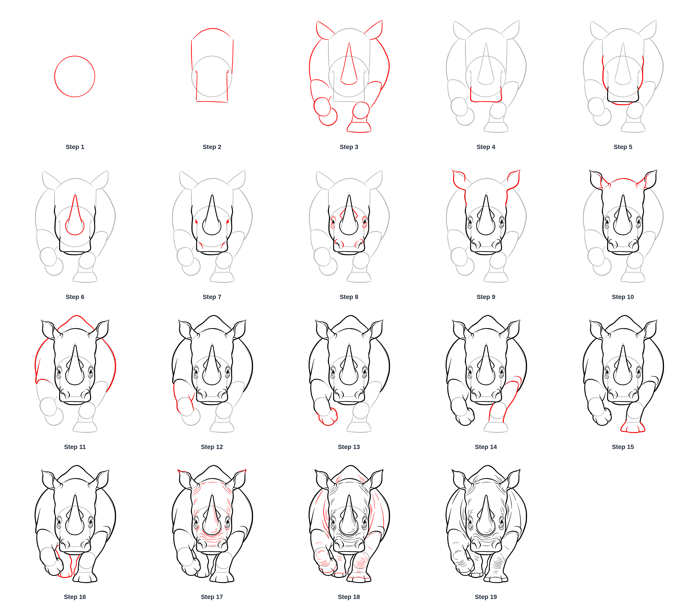
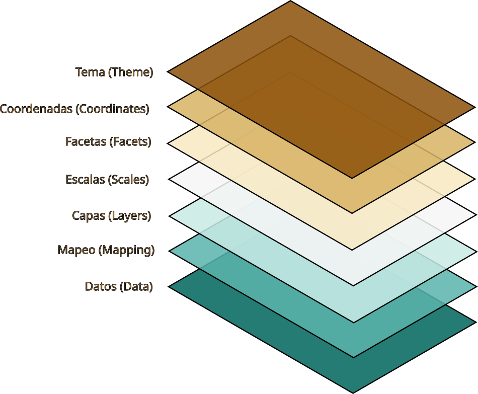
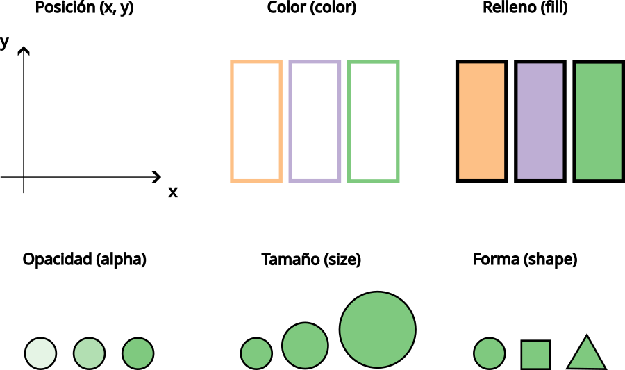

```{r}
#| label: load-packages
library(tidyverse)
library(scales)
```

```{r}
#| label: show-palette
show_palette <- function(hex_codes, n_col, size) {
  # Data
  data_palette <- tibble(
    hex_codes = as_factor(x = str_to_lower(hex_codes))
  )

  # Plot
  p <- ggplot(data_palette) +
    geom_rect(
      aes(
        xmin = 0,
        xmax = 1,
        ymin = 0,
        ymax = 1,
        fill = hex_codes
      ),
      color = "black"
    ) +
    geom_label(
      aes(
        x = 0.5,
        y = 0.5,
        label = hex_codes
      ),
      size = size,
      fill = "white"
    ) +
    scale_fill_manual(values = hex_codes) +
    facet_wrap(
      facets = vars(hex_codes),
      ncol = n_col
    ) +
    coord_fixed(expand = FALSE) +
    theme_void() +
    theme(
      strip.text = element_blank(),
      strip.background = element_blank(),
      panel.spacing = unit(0, "pt"),
      plot.margin = margin(0, 0, 0, 0, "pt"),
      legend.position = "none"
    )

  # Return
  return(p)
}
```

# Preliminares

## {.smaller .center}

::: {.incremental}
- Descargar datos: `2021-2024_saber-pro-genericas_faedis.rds`

- Generar carpetas:

  - `data`

    - Agregar `2021-2024_saber-pro-genericas_faedis.rds`

  - `006_visualizar-cantidades-en-r`

    - Crear archivo `001_visualizar-cantidades-datos-faedis.R`

  - `007_visualizar-distribuciones-en-r`

    - Crear archivo `001_visualizar-distribuciones-datos-faedis.R`
:::

# Gramática de gráficos en capas

## {.nostretch .center}

::: {#fig-gog-developers layout-ncol=3}
![Leland Wilkinson - Gramática de gráficos [@wilkinson_grammar_2005]](../images/leland-wilkinson.png){#fig-leland-wilkinson height="370px"}

{#fig-hadley-wickham height="370px"}

{#fig-hassan-kibirige height="370px"}

Figuras clave en la gramática de gráficos
:::

## {.nostretch}

::: {#fig-rhino layout-ncol=2}
{#fig-final-result height="410px"}

{.fragment .lightbox #fig-step-by-step height="410px"}

Dibujando un rinoceronte paso a paso [@khayrullin_how_2026-1]
:::

## {.nostretch .smaller .center}

:::: {.columns}

::: {.column width="50%"}
{.lightbox #fig-mental-model-lgog}
:::

::: {.column .fragment width="50%"}
- `ggplot2` requiere como mínimo 3 componentes: 

  - Datos: insumo principal.
  - Mapeo: mapear variables de los datos a propiedades visuales denominadas **atributos estéticos** (ver @fig-aesthetics-attributes).
  - Capas: toma los datos mapeados y los transforma en una presentación visual.

    - **geometría**
    - **transformación estadística**
    - **ajuste de posición**

- Los demás elementos restantes cuentan con valores predeterminados.
:::

::::

## {.nostretch .center}

{#fig-aesthetics-attributes}

# Gráfico de barras mediante conteo automático

##

```{r}
#| label: fig-quantities
#| fig-cap: Resultado final de un gráfico de barras utilizando `ggplot2`
#| fig-height: 5.5
#| echo: false
saber_pro_genericas_faedis_2021_2024 <- read_rds(
  file = "../data/2021-2024_saber-pro-genericas_faedis.rds"
)

ggplot(
  data = saber_pro_genericas_faedis_2021_2024,
  mapping = aes(y = fct_rev(fct_infreq(estu_prgm_academico)))
) +
  geom_bar() +
  scale_y_discrete(
    labels = label_wrap_gen(width = 18)
  ) +
  labs(
    x = "Número de inscritos",
    y = NULL,
    title = "Inscritos Saber Pro por programa en FAEDIS",
    subtitle = "Periodo: 2021 - 2024",
    caption = "Fuente: Data Icfes"
  )
```

## Datos {.smaller .center}

:::: {.columns}

::: {.column width="55%"}
```{r}
#| eval: false
#| echo: true
# Cargar paquetes ----
library(tidyverse)

# Importar datos ----
saber_pro_genericas_faedis_2021_2024 <- read_rds(
  file = "data/2021-2024_saber-pro-genericas_faedis.rds"
)

# Inspeccionar datos ----
glimpse(saber_pro_genericas_faedis_2021_2024)
```
:::

::: {.column width="45%"}
```{r}
glimpse(saber_pro_genericas_faedis_2021_2024)
```
:::
::::

## "Lienzo" {.smaller .center}

:::: {.columns}

::: {.column width="50%"}
```{r}
#| eval: false
#| echo: true
# Visualizar ----
ggplot(
  data = saber_pro_genericas_faedis_2021_2024
)
```
:::

::: {.column width="50%"}
```{r}
#| label: fig-init-obj-ggplot
#| fig-cap: Inicialización de un objeto `ggplot`
#| lightbox: true
ggplot(data = saber_pro_genericas_faedis_2021_2024)
```
:::
::::

## Mapeo {.smaller .center}

:::: {.columns}

::: {.column width="50%"}
```{r}
#| eval: false
#| echo: true
#| code-line-numbers: "|3|"
ggplot(
  data = saber_pro_genericas_faedis_2021_2024,
  mapping = aes(y = estu_prgm_academico)
)
```
:::

::: {.column width="50%"}

- ¿Por qué no utilizando la coordenada `x`?

```{r}
#| label: fig-map-aes-y
#| fig-cap:  Mapeo de datos hacia atributos estéticos utilizando la coordenada `y`
#| lightbox: true
ggplot(
  data = saber_pro_genericas_faedis_2021_2024,
  mapping = aes(y = estu_prgm_academico)
)
```
:::
::::

## Capas {.smaller}

:::: {.columns}

::: {.column width="50%"}
```{r}
#| eval: false
#| echo: true
#| code-line-numbers: "|5|10|18-21|"
ggplot(
  data = saber_pro_genericas_faedis_2021_2024,
  mapping = aes(y = estu_prgm_academico)
) +
  geom_bar()

ggplot(
  data = saber_pro_genericas_faedis_2021_2024,
  mapping = aes(
    y = fct_infreq(estu_prgm_academico)
  )
) +
  geom_bar()

ggplot(
  data = saber_pro_genericas_faedis_2021_2024,
  mapping = aes(
    y = fct_rev(
      fct_infreq(estu_prgm_academico)
    )
  )
) +
  geom_bar()
```
:::

::: {.column width="50%"}

- Geometrías[^1]

```{r}
#| label: fig-geom-bar
#| fig-cap: Uso de una geometría para ilustrar gráficamente datos a través de un atributo estético
#| lightbox: true
ggplot(
  data = saber_pro_genericas_faedis_2021_2024,
  mapping = aes(
    y = fct_rev(fct_infreq(estu_prgm_academico))
  )
) +
  geom_bar()
```
:::
::::

[^1]: No utilizaremos por ahora transformaciones estadísticas y ajustes de posición.

## Escalas {.smaller .center}

:::: {.columns}

::: {.column width="50%"}
```{r}
#| eval: false
#| echo: true
#| code-line-numbers: "|10-12|"
ggplot(
  data = saber_pro_genericas_faedis_2021_2024,
  mapping = aes(
    y = fct_rev(
      fct_infreq(estu_prgm_academico)
    )
  )
) +
  geom_bar() +
  scale_y_discrete(
    labels = label_wrap_gen(width = 18)
  )
```
:::

::: {.column width="50%"}
```{r}
#| label: fig-scale-y-discrete
#| fig-cap: Uso de una escala para modificar las etiquetas en la coordenada `y`
#| lightbox: true
ggplot(
  data = saber_pro_genericas_faedis_2021_2024,
  mapping = aes(y = fct_rev(fct_infreq(estu_prgm_academico)))
) +
  geom_bar() +
  scale_y_discrete(
    labels = label_wrap_gen(width = 18)
  )
```
:::
::::

## Escalas {.smaller}

:::: {.columns}

::: {.column width="50%"}
```{r}
#| eval: false
#| echo: true
#| code-line-numbers: "|13-19|"
ggplot(
  data = saber_pro_genericas_faedis_2021_2024,
  mapping = aes(
    y = fct_rev(
      fct_infreq(estu_prgm_academico)
    )
  )
) +
  geom_bar() +
  scale_y_discrete(
    labels = label_wrap_gen(width = 18)
  ) +
  labs(
    x = "Número de inscritos",
    y = NULL,
    title = "Inscritos Saber Pro por programa en FAEDIS",
    subtitle = "Periodo: 2021 - 2024",
    caption = "Fuente: Data Icfes"
  )
```
:::

::: {.column width="50%"}

- Etiquetas
```{r}
#| label: fig-scale-labs
#| fig-cap: Uso de la función `labs()` para agregar, modificar o eliminar etiquetas en un gráfico 
#| lightbox: true
ggplot(
  data = saber_pro_genericas_faedis_2021_2024,
  mapping = aes(
    y = fct_rev(
      fct_infreq(estu_prgm_academico)
    )
  )
) +
  geom_bar() +
  scale_y_discrete(
    labels = label_wrap_gen(width = 18)
  ) +
  labs(
    x = "Número de inscritos",
    y = NULL,
    title = "Inscritos Saber Pro por programa en FAEDIS",
    subtitle = "Periodo: 2021 - 2024",
    caption = "Fuente: Data Icfes"
  )
```
:::
::::

# Histograma

##

```{r}
#| label: fig-histogram
#| fig-cap: Resultado final de un histograma utilizando `ggplot2`
#| fig-height: 5.5
#| echo: false
paleta_primaria_umng <- c(
  "#043074",
  "#fdc600",
  "#0d5e30",
  "#ee2a24",
  "#000000",
  "#ffffff"
)

ggplot(
  data = saber_pro_genericas_faedis_2021_2024,
  mapping = aes(x = mod_ingles_punt)
) +
  geom_histogram(
    mapping = aes(fill = mod_ingles_desem),
    color = "black",
    boundary = 0,
    bins = 40
  ) +
  scale_fill_manual(
    values = paleta_primaria_umng[1:4]
  ) +
  labs(
    x = "Puntaje (rango [0, 300])",
    y = "Frecuencia",
    fill = "Nivel de desempeño",
    title = "Distribución puntaje módulo inglés en FAEDIS",
    subtitle = "Periodo: 2021 - 2024",
    caption = "Fuente: Data Icfes"
  ) +
  theme(
    legend.position = "bottom"
  )
```

## Datos {.smaller .center}

:::: {.columns}

::: {.column width="55%"}
```{r}
#| eval: false
#| echo: true
# Cargar paquetes ----
library(tidyverse)

# Importar datos ----
saber_pro_genericas_faedis_2021_2024 <- read_rds(
  file = "data/2021-2024_saber-pro-genericas_faedis.rds"
)

# Inspeccionar datos ----
glimpse(saber_pro_genericas_faedis_2021_2024)
```
:::

::: {.column width="45%"}
```{r}
glimpse(saber_pro_genericas_faedis_2021_2024)
```
:::
::::

## Mapeos y capas {.smaller .center}

:::: {.columns}

::: {.column width="50%"}
```{r}
#| eval: false
#| echo: true
# Visualizar ----
ggplot(
  data = saber_pro_genericas_faedis_2021_2024,
  mapping = aes(x = mod_ingles_punt)
) +
  geom_histogram()
```
:::

::: {.column width="50%"}

- Mensaje respecto al número de contenedores (`bins`)

<!-- 
see
https://github.com/tidyverse/ggplot2/blob/0ac300f2aeaf259c84e9205c53b3d1189452043a/R/bin.R#L266 
in the source code
-->

```{r}
#| label: fig-mapping-geom-histograms
#| fig-cap: Uso de mapeo y una geometría para ilustrar gráficamente la distribución de una variable numérica 
#| lightbox: true
#| message: true
ggplot(
  data = saber_pro_genericas_faedis_2021_2024,
  mapping = aes(x = mod_ingles_punt)
) +
  geom_histogram()
```
:::
::::

## Mapeos y capas {.smaller .center}

:::: {.columns}

::: {.column width="50%"}
```{r}
#| eval: false
#| echo: true
#| code-line-numbers: "|6-7|8-9|"
ggplot(
  data = saber_pro_genericas_faedis_2021_2024,
  mapping = aes(x = mod_ingles_punt)
) +
  geom_histogram(
    boundary = 0,
    bins = 40,
    color = "black",
    fill = "yellow"
  )
```
:::

::: {.column width="50%"}
 
- `color` y `fill` por fuera de `aes()`

```{r}
#| label: fig-color-fill
#| fig-cap: Asignación de colores por fuera de `aes()` para los atributos estéticos `color` y `fill` en una geometría asociada con un histograma  
#| lightbox: true
ggplot(
  data = saber_pro_genericas_faedis_2021_2024,
  mapping = aes(x = mod_ingles_punt)
) +
  geom_histogram(
    boundary = 0,
    bins = 40,
    color = "black",
    fill = "yellow"
  )
```
:::
::::

## Mapeos y capas {.smaller .center}

:::: {.columns}

::: {.column width="50%"}
```{r}
#| eval: false
#| echo: true
#| code-line-numbers: "|6|"
ggplot(
  data = saber_pro_genericas_faedis_2021_2024,
  mapping = aes(x = mod_ingles_punt)
) +
  geom_histogram(
    mapping = aes(fill = mod_ingles_desem),
    boundary = 0,
    bins = 40,
    color = "black"
  )
```
:::

::: {.column width="50%"}
 
- `fill` por dentro de `aes()`

```{r}
#| label: fig-aes-fill
#| fig-cap: Asignación de colores dentro de `aes()` para el atributo estético `fill` en una geometría asociada con un histograma  
#| lightbox: true
ggplot(
  data = saber_pro_genericas_faedis_2021_2024,
  mapping = aes(x = mod_ingles_punt)
) +
  geom_histogram(
    mapping = aes(fill = mod_ingles_desem),
    boundary = 0,
    bins = 40,
    color = "black"
  )
```
:::
::::

## Escalas {.smaller .center}

:::: {.columns}

::: {.column width="50%"}
```{r}
#| eval: false
#| echo: true
# Paleta primaria UMNG ----
paleta_primaria_umng <- c(
  "#043074",
  "#fdc600",
  "#0d5e30",
  "#ee2a24",
  "#000000",
  "#ffffff"
)
```
:::

::: {.column width="50%"}
 
- Paleta de colores primaria UMNG

```{r}
#| label: fig-palette-umng
#| fig-cap: Paleta de colores primaria de la Universidad Militar Nueva Granada (UMNG) de acuerdo al Manual de Identidad Visual [@umng_manual_2024]  
#| lightbox: true
#| fig-height: 4
# See the source code of scale_fill_viridis_d
# from the scales package in relation to
# palette = pal_viridis(alpha, begin, end, direction, option)
show_palette(
  hex_codes = paleta_primaria_umng,
  n_col = 3,
  size = 8
)
```

- Representación hexadecimal de colores

  - Ver [@w3schools_html_2026]

:::
::::

## Escalas {.smaller}

:::: {.columns}

::: {.column width="50%"}
```{r}
#| eval: false
#| echo: true
#| code-line-numbers: "|11-13|"
ggplot(
  data = saber_pro_genericas_faedis_2021_2024,
  mapping = aes(x = mod_ingles_punt)
) +
  geom_histogram(
    mapping = aes(fill = mod_ingles_desem),
    boundary = 0,
    bins = 40,
    color = "black"
  ) +
  scale_fill_manual(
    values = paleta_primaria_umng[1:4]
  )
```
:::

::: {.column width="50%"}
 
- Personalización paleta de colores

```{r}
#| label: fig-scale-fill-manual
#| fig-cap: Personalización de la paleta de colores asociada al atributo estético `fill` dentro de `aes()` en una geometría   
#| lightbox: true
ggplot(
  data = saber_pro_genericas_faedis_2021_2024,
  mapping = aes(x = mod_ingles_punt)
) +
  geom_histogram(
    mapping = aes(fill = mod_ingles_desem),
    boundary = 0,
    bins = 40,
    color = "black"
  ) +
  scale_fill_manual(
    values = paleta_primaria_umng[1:4]
  )
```

:::
::::

## Escalas {.smaller}

:::: {.columns}

::: {.column width="50%"}
```{r}
#| eval: false
#| echo: true
#| code-line-numbers: "|14-21|"
ggplot(
  data = saber_pro_genericas_faedis_2021_2024,
  mapping = aes(x = mod_ingles_punt)
) +
  geom_histogram(
    mapping = aes(fill = mod_ingles_desem),
    color = "black",
    boundary = 0,
    bins = 40
  ) +
  scale_fill_manual(
    values = paleta_primaria_umng[1:4]
  ) +
  labs(
    x = "Puntaje (rango [0, 300])",
    y = "Frecuencia",
    fill = "Nivel de desempeño",
    title = "Distribución puntaje módulo inglés en FAEDIS",
    subtitle = "Periodo: 2021 - 2024",
    caption = "Fuente: Data Icfes"
  )
```
:::

::: {.column width="50%"}
 
- Etiquetas

```{r}
#| label: fig-scale-labs-2
#| fig-cap: Personalización de la paleta de colores asociada al atributo estético `fill` dentro de `aes()` en una geometría   
#| lightbox: true
ggplot(
  data = saber_pro_genericas_faedis_2021_2024,
  mapping = aes(x = mod_ingles_punt)
) +
  geom_histogram(
    mapping = aes(fill = mod_ingles_desem),
    color = "black",
    boundary = 0,
    bins = 40
  ) +
  scale_fill_manual(
    values = paleta_primaria_umng[1:4]
  ) +
  labs(
    x = "Puntaje (rango [0, 300])",
    y = "Frecuencia",
    fill = "Nivel de desempeño",
    title = "Distribución puntaje módulo inglés en FAEDIS",
    subtitle = "Periodo: 2021 - 2024",
    caption = "Fuente: Data Icfes"
  )
```

:::
::::

## Tema {.smaller}

:::: {.columns}

::: {.column width="50%"}
```{r}
#| eval: false
#| echo: true
#| code-line-numbers: "|22-24|"
ggplot(
  data = saber_pro_genericas_faedis_2021_2024,
  mapping = aes(x = mod_ingles_punt)
) +
  geom_histogram(
    mapping = aes(fill = mod_ingles_desem),
    color = "black",
    boundary = 0,
    bins = 40
  ) +
  scale_fill_manual(
    values = paleta_primaria_umng[1:4]
  ) +
  labs(
    x = "Puntaje (rango [0, 300])",
    y = "Frecuencia",
    fill = "Nivel de desempeño",
    title = "Distribución puntaje módulo inglés en FAEDIS",
    subtitle = "Periodo: 2021 - 2024",
    caption = "Fuente: Data Icfes"
  ) +
  theme(
    legend.position = "bottom"
  )
```
:::

::: {.column width="50%"}
 
- Modificación de la posición de la leyenda

```{r}
#| label: fig-theme
#| fig-cap: Uso de la función `theme()` para modificar la posición de una leyenda   
#| lightbox: true
ggplot(
  data = saber_pro_genericas_faedis_2021_2024,
  mapping = aes(x = mod_ingles_punt)
) +
  geom_histogram(
    mapping = aes(fill = mod_ingles_desem),
    color = "black",
    boundary = 0,
    bins = 40
  ) +
  scale_fill_manual(
    values = paleta_primaria_umng[1:4]
  ) +
  labs(
    x = "Puntaje (rango [0, 300])",
    y = "Frecuencia",
    fill = "Nivel de desempeño",
    title = "Distribución puntaje módulo inglés en FAEDIS",
    subtitle = "Periodo: 2021 - 2024",
    caption = "Fuente: Data Icfes"
  ) +
  theme(
    legend.position = "bottom"
  )
```

:::
::::

## {background-image="../images/backgrounds/bird-umng-1.jpg"}

::: {.r-fit-text}
Gracias
:::

# Referencias {.unnumbered .smaller}