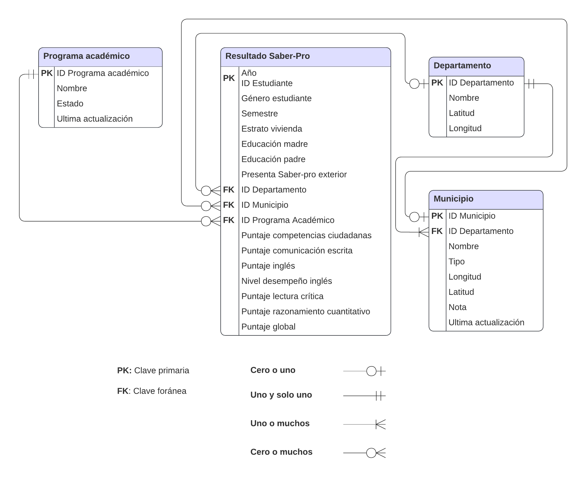
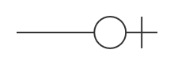
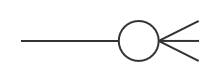
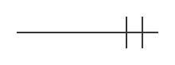
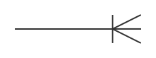
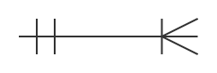

```{r}
#| label: load-packages
library(tidyverse)
```

# Preliminares

## {.smaller .center}

::: {.incremental}
- Verificar: 

  - ¿La carpeta `data` fue creada?

- Generar carpetas:

  - `011_verbos-dos-tablas-en-r`

    - Crear archivo `001_manipular-datos-dos-tabla.R`

- Descargar datos: 

  - `resultados-saber-pro.rds`
  - `divipola-departamentos.rds`
  - `divipola-municipios.rds`
  - `programas-pregrado-faedis.rds`

     - Agregar en `data`
:::

# Diagrama Entidad-Relación

## {.smaller .center}

::: {.incremental}
- En el análisis de datos es habitual tener que **combinar dos o más tablas**.
- Esta necesidad surge del diseño propio de las **bases de datos relacionales** [@wickham_r_2023, Cap. 19].
- Un **Diagrama Entidad-Relación** (Entity-Relationship Diagram - ERD) ilustra cómo un conjunto de tablas de una base de datos relacional se relacionan entre sí.
- Los diagramas ERD se componen de 3 elementos fundamentales:
  1. **Entidades**: representan cualquier objeto, concepto o evento.
  2. **Atributos**: características, rasgos o propiedades de cada entidad.
  3. **Relaciones**: asociación o vínculo lógico que existe entre dos o más entidades.
:::

## {.smaller .center}

{.nostretch .lightbox #fig-erd width=65%}

## Entidades {.smaller .center}

En el modelo para analizar los resultados Saber-Pro de FAEDIS se definen 4 entidades:

::: {.incremental}
a. **Resultado Saber-Pro**: modela el evento de un estudiante presentando las pruebas Saber-Pro en un periodo y lugar específico, junto con sus características socioeconómicas y resultados.
b. **Programa académico**: representa los programas académicos de pregrado de FAEDIS a los cuales puede potencialmente pertenecer un estudiante.
c. **Departamento**: división político-administrativa a nivel departamental según la codificación DIVIPOLA con información geográfica.
d. **Municipio**: división político-administrativa a nivel municipal según la codificación DIVIPOLA con información geográfica.
:::

## Entidades {.smaller .center}

::: {.incremental}
- A un elemento específico y concreto de una entidad se le denomina **instancia**.
- Ejemplos:
  - *Amazonas* es una instancia de la entidad **Departamento**.
  - *Cajicá* es una instancia de la entidad **Municipio**.
  - *Ingeniería Industrial* es una instancia de la entidad **Programa académico**.
:::

## Atributos {.smaller .center}

::: {.incremental}
- Los **atributos** son las características, rasgos o propiedades de cada entidad.
- Cada atributo se recopila en una **variable** y se almacena en una **columna** dentro de una tabla.
- Por ejemplo, la entidad **Departamento** se describe mediante:
  - `ID Departamento`: identificador único según DIVIPOLA.
  - `Nombre`: denominación oficial.
  - `Latitud` y `Longitud`: ubicación geográfica representativa.
:::

## Atributos {.smaller .center}

### Clave primaria (Primary Key - PK)

::: {.incremental}
- Atributo (o conjunto de atributos) que identifica de forma **única** cada registro dentro de una tabla.
- Reglas fundamentales:
  1. **Unicidad**: cada valor debe ser único en la tabla.
  2. **No nulidad**: no puede contener valores vacíos o ausentes (`NA` o `NULL`).
  3. **Inmutabilidad**: su valor no debe cambiar con el tiempo.
- Puede estar formada por una sola columna (p. ej. `ID Departamento` en **Departamento**) o por múltiples columnas (clave compuesta, p. ej. `Año` y `ID estudiante` en **Resultado Saber-Pro**).
:::

## Atributos {.smaller .center}

### Clave foránea (Foreign Key - FK)

::: {.incremental}
- Atributo en una tabla cuyos valores hacen referencia directa a la **clave primaria (PK)** de otra tabla.
- Es el **puente** que permite establecer una relación entre dos entidades y vincular datos sin duplicar información.
- **Diferencias clave respecto a la PK**:
  - Sus valores **sí se pueden repetir** en una tabla (muchos estudiantes presentan el examen en un mismo departamento).
  - **Sí puede contener valores ausentes (`NA`)** (p. ej., si un estudiante presenta el examen en el exterior no tiene asociado un departamento colombiano).
:::

## Relaciones {.smaller .center}

### Cardinalidad

::: {.incremental}
- Las relaciones definen cómo se vinculan lógicamente dos entidades a través de claves primarias y foráneas.
- La **cardinalidad** define las restricciones numéricas que gobiernan el vínculo lógico entre 2 entidades:

  > *¿Con cuántas instancias de una entidad `A` se puede vincular una instancia de la entidad `B`?*

- Se descompone en dos límites:
  - **Mínimo**: `0` (opcional) o `1` (obligatorio).
  - **Máximo**: `1` (uno) o `N` (muchos).
:::

## Relaciones {.smaller .center}

### Notación Crow's Foot ("Pata de cuervo")

:::  {style="font-size: 120%;"}

| Símbolo | Representación gráfica | Descripción |
| :--- | :---: | :--- |
| `0` | {height=35} | Cero (opcional) |
| `1` | {height=35} | Uno |
| `N` | {height=35} | Muchos |

: Símbolos en la notación Crow's Foot {#tbl-symbols-crow-foot}

:::

## Relaciones {.smaller .center}

### Cardinalidad en notación Crow's Foot

::: {style="font-size: 80%;"}

| Cardinalidad | Representación gráfica | Significado |
| :--- | :---: | :--- |
| `0` o `1` | {height=35} | Mínimo cero, máximo uno |
| `0` o `N` | {height=35} | Mínimo cero, máximo muchos |
| `1` y solo `1` | {height=35} | Mínimo uno, máximo uno |
| `1` o `N` | {height=35} | Mínimo uno, máximo muchos |

: Representación gráfica de la cardinalidad {#tbl-relation-cardinality-crow-foot}

:::

## Relaciones {.smaller .center}

### Ejemplo: Departamento y Municipio

::: {.incremental}
- Un departamento contiene **uno o muchos** municipios: {height=30}
- Un municipio pertenece a **uno y solo un** departamento: {height=30}
- Unión compacta de la relación: {height=30}
:::

# Gramática de manipulación de datos

## Verbos {.smaller .center}

En el paquete `dplyr`, existen 3 tipos de verbos para conectar o manipular dos tablas de datos:

::: {.incremental}
1. **Mutating joins** (uniones de transformación): combinan variables de diferentes tablas correspondientes a 2 entidades.
2. **Filtering joins** (uniones de filtrado): buscan coincidencias entre registros afectando a las observaciones (filas), sin añadir variables.
3. **Set operations** (operaciones de conjuntos): tratan observaciones como conjuntos matemáticos (`intersect()`, `union()`, `setdiff()`).

   ::: {.callout-note}
   Debido a que las **Set operations** no se requieren para los análisis que desarrollaremos a lo largo del curso, no se profundizará en ellas. No obstante,  el lector interesado puede consultar la [documentación oficial](https://dplyr.tidyverse.org/reference/setops.html) de `dplyr` para conocer más detalles sobre este tipo de operaciones.
   :::
:::

## Verbos {.smaller .center}

### Filtering joins

Existen dos tipos de uniones de filtrado:

::: {.incremental}
- **`semi_join(x, y)`**: mantiene todas las observaciones de `x` que tienen una coincidencia en `y`.
- **`anti_join(x, y)`**: descarta todas las observaciones de `x` que tienen una coincidencia en `y` (mantiene las que **no** coinciden).
:::

## Verbos {.smaller .center}

### Importar

:::: {.columns}

::: {.column width="48%"}
```{r}
#| eval: false
#| echo: true
# Cargar paquetes ----
library(tidyverse)

# Importar datos ----
divipola_departamentos <- read_rds(
  file = "data/divipola-departamentos.rds"
)

resultado_saber_pro <- read_rds(
  file = "data/resultados-saber-pro.rds"
)
```
:::

::: {.column width="52%"}
```{r}
#| message: false
# Cargar paquetes ----
library(tidyverse)

# Importar datos ----
divipola_departamentos <- read_rds(
  file = "../data/divipola-departamentos.rds"
)

resultado_saber_pro <- read_rds(
  file = "../data/resultados-saber-pro.rds"
)
```
:::

::::

## Verbos {.smaller .center}

### Inspeccionar datos

:::: {.columns}

::: {.column width="48%"}
```{r}
#| eval: false
#| echo: true
divipola_departamentos |>
  glimpse()
```
:::

::: {.column width="52%"}
```{r}
divipola_departamentos |>
  glimpse()
```
:::

::::

## Verbos {.smaller .center}

### Inspeccionar datos

:::: {.columns}

::: {.column width="48%"}
```{r}
#| eval: false
#| echo: true
resultado_saber_pro |>
  glimpse()
```
:::

::: {.column width="52%"}
::: {style="font-size: 70%;"}
```{r}
resultado_saber_pro |>
  glimpse()
```
:::
:::

::::

## Verbos {.smaller .center}

### `semi_join()`

:::: {.columns}

::: {.column width="48%"}
```{r}
#| eval: false
#| echo: true
#| code-line-numbers: "|3|4|5-7|"
# Departamentos con al menos un examen
semi_join(
  x = divipola_departamentos,
  y = resultado_saber_pro,
  by = join_by(
    codigo == estu_cod_depto_presentacion
  )
)
```
:::

::: {.column width="52%"}
::: {style="font-size: 75%;"}
```{r}
semi_join(
  x = divipola_departamentos,
  y = resultado_saber_pro,
  by = join_by(
    codigo == estu_cod_depto_presentacion
  )
)
```
:::
:::

::::

## Verbos {.smaller .center}

### `anti_join()`

:::: {.columns}

::: {.column width="48%"}
```{r}
#| eval: false
#| echo: true
#| code-line-numbers: "|3|4|5-7|"
# Departamentos sin exámenes registrados
anti_join(
  x = divipola_departamentos,
  y = resultado_saber_pro,
  by = join_by(
    codigo == estu_cod_depto_presentacion
  )
)
```
:::

::: {.column width="52%"}
::: {style="font-size: 75%;"}
```{r}
anti_join(
  x = divipola_departamentos,
  y = resultado_saber_pro,
  by = join_by(
    codigo == estu_cod_depto_presentacion
  )
)
```
:::
:::

::::

## Mutating joins {.smaller .center}

Las **Mutating joins** permiten combinar variables de 2 tablas vinculando sus filas mediante claves:

::: {.incremental}
1. **`inner_join()`**: conserva únicamente observaciones con coincidencia en **ambas** tablas (`x` y `y`).
2. **`left_join()`**: conserva todas las observaciones de la tabla izquierda (`x`), incorporando variables de la derecha (`y`).
3. **`right_join()`**: conserva todas las observaciones de la tabla derecha (`y`), incorporando variables de la izquierda (`x`).
4. **`full_join()`**: conserva todas las observaciones de **ambas** tablas (`x` y `y`), completando con `NA` donde no haya coincidencia.
:::

## Mutating joins {.smaller .center}

### Ejemplo ilustrativo mínimo

:::: {.columns}

::: {.column width="50%"}
```{r}
#| eval: false
#| echo: true
# Tabla x ----
x <- tibble(
  key = c(1, 2),
  z = c(3, 4)
)

x
```

```{r}
#| echo: false
x <- tibble(
  key = c(1, 2),
  z = c(3, 4)
)
x
```
:::

::: {.column width="50%"}
```{r}
#| eval: false
#| echo: true
# Tabla y ----
y <- tibble(
  key = c(3, 1),
  a = 10,
  b = "s"
)

y
```

```{r}
#| echo: false
y <- tibble(
  key = c(3, 1),
  a = 10,
  b = "s"
)
y
```
:::

::::

## `inner_join()` {.smaller .center}

{.lightbox #fig-inner-join}

## `inner_join()` {.smaller .center}

:::: {.columns}

::: {.column width="48%"}
```{r}
#| eval: false
#| echo: true
#| code-line-numbers: "|2|3|4|"
inner_join(
  x = x,
  y = y,
  by = join_by(key)
)
```
:::

::: {.column width="52%"}
```{r}
inner_join(
  x = x,
  y = y,
  by = join_by(key)
)
```
:::

::::

::: {.incremental}
- Conserva únicamente la fila con `key = 1` (presente tanto en `x` como en `y`).
- Las filas con `key = 2` (en `x`) y `key = 3` (en `y`) se descartan automáticamente.
:::

## `left_join()` {.smaller .center}

{.lightbox #fig-left-join}

## `left_join()` {.smaller .center}

:::: {.columns}

::: {.column width="48%"}
```{r}
#| eval: false
#| echo: true
#| code-line-numbers: "|2|3|4|"
left_join(
  x = x,
  y = y,
  by = join_by(key)
)
```
:::

::: {.column width="52%"}
```{r}
left_join(
  x = x,
  y = y,
  by = join_by(key)
)
```
:::

::::

::: {.incremental}
- Conserva todas las filas de `x` (`key = 1` y `key = 2`).
- Para `key = 1`, agrega los valores `a = 10` y `b = "s"`.
- Para `key = 2`, como no existe en `y`, rellena `a` y `b` con `NA`.
:::

## `right_join()` {.smaller .center}

{.lightbox #fig-right-join}

## `right_join()` {.smaller .center}

:::: {.columns}

::: {.column width="48%"}
```{r}
#| eval: false
#| echo: true
#| code-line-numbers: "|2|3|4|"
right_join(
  x = x,
  y = y,
  by = join_by(key)
)
```
:::

::: {.column width="52%"}
```{r}
right_join(
  x = x,
  y = y,
  by = join_by(key)
)
```
:::

::::

::: {.incremental}
- Conserva todas las filas de `y` (`key = 3` y `key = 1`).
- Para `key = 3`, como no existe en `x`, rellena `z` con `NA`.
- Para `key = 1`, agrega el valor coincidente `z = 3`.
:::

## `full_join()` {.smaller .center}

{.lightbox #fig-full-join}

## `full_join()` {.smaller .center}

:::: {.columns}

::: {.column width="48%"}
```{r}
#| eval: false
#| echo: true
#| code-line-numbers: "|2|3|4|"
full_join(
  x = x,
  y = y,
  by = join_by(key)
)
```
:::

::: {.column width="52%"}
```{r}
full_join(
  x = x,
  y = y,
  by = join_by(key)
)
```
:::

::::

::: {.incremental}
- Conserva todas las filas de ambas tablas (`key = 1`, `key = 2` y `key = 3`).
- Los valores no coincidentes se completan con `NA` en las columnas correspondientes.
:::

# Caso de estudio: consolidación de resultados Saber-Pro para FAEDIS

## Importar {.smaller .center}

:::: {.columns}

::: {.column width="48%"}
```{r}
#| eval: false
#| echo: true
divipola_municipios <- read_rds(
  file = "data/divipola-municipios.rds"
)

programas_pregrado_faedis <- read_rds(
  file = "data/programas-pregrado-faedis.rds"
)
```
:::

::: {.column width="52%"}
```{r}
#| message: false
divipola_municipios <- read_rds(
  file = "../data/divipola-municipios.rds"
)

programas_pregrado_faedis <- read_rds(
  file = "../data/programas-pregrado-faedis.rds"
)
```
:::

::::

## Inspeccionar {.smaller .center}

:::: {.columns}

::: {.column width="48%"}
```{r}
#| eval: false
#| echo: true
divipola_municipios |>
  glimpse()

programas_pregrado_faedis |>
  glimpse()
```
:::

::: {.column width="52%"}
::: {style="font-size: 70%;"}
```{r}
divipola_municipios |>
  glimpse()

programas_pregrado_faedis |>
  glimpse()
```
:::
:::

::::

## Inconsistencia en datos del exterior {.smaller .center}

::::: {.columns}

:::: {.fragment}

- En Data Icfes, cuando un estudiante presenta el examen en el exterior (`estu_exterior == "SI"`), se asigna por defecto el código de Bogotá.
::::

:::: {.fragment}
- Esto genera una inconsistencia con el modelo relacional.
::::

:::: {.fragment}

::: {.column width="48%"}

```{r}
#| eval: false
#| echo: true
resultado_saber_pro |>
  filter(estu_exterior == "SI") |>
  select(
    ano,
    estu_consecutivo,
    estu_exterior,
    estu_cod_depto_presentacion,
    estu_cod_mcpio_presentacion
  ) |>
  glimpse()
```

:::

::: {.column width="52%"}

::: {style="font-size: 75%;"}
```{r}
resultado_saber_pro |>
  filter(estu_exterior == "SI") |>
  select(
    ano,
    estu_consecutivo,
    estu_exterior,
    estu_cod_depto_presentacion,
    estu_cod_mcpio_presentacion
  ) |>
  glimpse()
```
:::

:::

::::

:::::

## Función `replace_when()` {.smaller .center}

::: {.incremental}
- `replace_when()` en `dplyr` permite actualizar de forma condicional los valores de un vector o columna:
  - `x`: vector o variable de entrada a modificar.
  - `...`: secuencia de fórmulas de dos lados (**two-sided formulas**) de la forma `condición ~ valor_de_reemplazo`:
    - **Lado izquierdo (LHS)**: condición lógica evaluada sobre cada observación (`TRUE`).
    - **Lado derecho (RHS)**: valor con el que se reemplazan las observaciones que cumplen la condición.
- Las observaciones que no cumplen la condición conservan automáticamente su valor original desde `x`.
:::

## Ajuste de datos con `replace_when()` {.smaller .center}

:::: {.columns}

::: {.column width="48%"}
```{r}
#| eval: false
#| echo: true
#| code-line-numbers: "|2-6|4|5|7-10|8|9|"
resultado_saber_pro_ajustado <- resultado_saber_pro |>
  mutate(
    estu_cod_depto_presentacion = replace_when(
      x = estu_cod_depto_presentacion,
      estu_exterior == "SI" ~ NA
    ),
    estu_cod_mcpio_presentacion = replace_when(
      x = estu_cod_mcpio_presentacion,
      estu_exterior == "SI" ~ NA
    )
  )
```
:::

::: {.column width="52%"}
```{r}
resultado_saber_pro_ajustado <- resultado_saber_pro |>
  mutate(
    estu_cod_depto_presentacion = replace_when(
      x = estu_cod_depto_presentacion,
      estu_exterior == "SI" ~ NA
    ),
    estu_cod_mcpio_presentacion = replace_when(
      x = estu_cod_mcpio_presentacion,
      estu_exterior == "SI" ~ NA
    )
  )
```

::: {style="font-size: 75%;"}
```{r}
resultado_saber_pro_ajustado |>
  filter(estu_exterior == "SI") |>
  select(
    ano,
    estu_consecutivo,
    estu_exterior,
    estu_cod_depto_presentacion,
    estu_cod_mcpio_presentacion
  ) |>
  glimpse()
```
:::
:::

::::

## Verificación registros en Colombia {.smaller .center}

:::: {.columns}

::: {.column width="48%"}
```{r}
#| eval: false
#| echo: true
# Registros en Colombia conservan sus códigos
resultado_saber_pro_ajustado |>
  filter(estu_exterior == "NO") |>
  select(
    ano,
    estu_consecutivo,
    estu_exterior,
    estu_cod_depto_presentacion,
    estu_cod_mcpio_presentacion
  ) |>
  glimpse()
```
:::

::: {.column width="52%"}
::: {style="font-size: 75%;"}
```{r}
resultado_saber_pro_ajustado |>
  filter(estu_exterior == "NO") |>
  select(
    ano,
    estu_consecutivo,
    estu_exterior,
    estu_cod_depto_presentacion,
    estu_cod_mcpio_presentacion
  ) |>
  glimpse()
```
:::
:::

::::

## Selección y filtro variables de interés {.smaller .center}

```{r}
#| echo: true
#| code-line-numbers: "|1-6|8-12|14-18|"
programas_pregrado_faedis <- programas_pregrado_faedis |>
  filter(estado_programa == "Activo") |>
  select(
    codigo_snies_programa,
    nombre_programa
  )

divipola_departamentos <- divipola_departamentos |>
  select(
    codigo,
    nombre
  )

divipola_municipios <- divipola_municipios |>
  select(
    codigo_municipio,
    nombre_municipio
  )
```

## Uso secuencial `left_join()` {.smaller .center}

::::: {.columns}

:::: {.column width="48%"}
```{r}
#| eval: false
#| echo: true
#| code-line-numbers: "|2-7|8-13|14-19|"
resultado_saber_pro_ajustado <- resultado_saber_pro_ajustado |>
  left_join(
    y = programas_pregrado_faedis,
    by = join_by(
      estu_snies_prgmacademico == codigo_snies_programa
    )
  ) |>
  left_join(
    y = divipola_departamentos,
    by = join_by(
      estu_cod_depto_presentacion == codigo
    )
  ) |>
  left_join(
    y = divipola_municipios,
    by = join_by(
      estu_cod_mcpio_presentacion == codigo_municipio
    )
  )

resultado_saber_pro_ajustado |>
  glimpse()
```
::::

:::: {.column width="52%"}

::: {style="font-size: 70%;"}
```{r}
resultado_saber_pro_ajustado <- resultado_saber_pro_ajustado |>
  left_join(
    y = programas_pregrado_faedis,
    by = join_by(
      estu_snies_prgmacademico == codigo_snies_programa
    )
  ) |>
  left_join(
    y = divipola_departamentos,
    by = join_by(
      estu_cod_depto_presentacion == codigo
    )
  ) |>
  left_join(
    y = divipola_municipios,
    by = join_by(
      estu_cod_mcpio_presentacion == codigo_municipio
    )
  )

resultado_saber_pro_ajustado |>
  glimpse()
```
:::

::::

:::::

## Renombrar columnas agregadas {.smaller .center}

::::: {.columns}

:::: {.column width="48%"}
```{r}
#| eval: false
#| echo: true
#| code-line-numbers: "|2-6|3|4|5|"
resultado_saber_pro_ajustado <- resultado_saber_pro_ajustado |>
  rename(
    estu_prgm_academico = nombre_programa,
    estu_depto_presentacion = nombre,
    estu_mcpio_presentacion = nombre_municipio
  )

resultado_saber_pro_ajustado |>
  glimpse()
```
::::

:::: {.column width="52%"}

::: {style="font-size: 70%;"}
```{r}
resultado_saber_pro_ajustado <- resultado_saber_pro_ajustado |>
  rename(
    estu_prgm_academico = nombre_programa,
    estu_depto_presentacion = nombre,
    estu_mcpio_presentacion = nombre_municipio
  )

resultado_saber_pro_ajustado |>
  glimpse()
```
:::

::::

:::::

## Reubicar columnas con `relocate()` {.smaller .center}

:::: {.columns}

::: {.column width="48%"}
```{r}
#| eval: false
#| echo: true
#| code-line-numbers: "|2-5|6-9|10-13|"
resultado_saber_pro_ajustado <- resultado_saber_pro_ajustado |>
  relocate(
    estu_prgm_academico,
    .after = estu_snies_prgmacademico
  ) |>
  relocate(
    estu_depto_presentacion,
    .after = estu_cod_depto_presentacion
  ) |>
  relocate(
    estu_mcpio_presentacion,
    .after = estu_cod_mcpio_presentacion
  )

resultado_saber_pro_ajustado |>
  glimpse()
```
:::

::: {.column width="52%"}
```{r}
resultado_saber_pro_ajustado <- resultado_saber_pro_ajustado |>
  relocate(
    estu_prgm_academico,
    .after = estu_snies_prgmacademico
  ) |>
  relocate(
    estu_depto_presentacion,
    .after = estu_cod_depto_presentacion
  ) |>
  relocate(
    estu_mcpio_presentacion,
    .after = estu_cod_mcpio_presentacion
  )
```

::: {style="font-size: 70%;"}
```{r}
resultado_saber_pro_ajustado |>
  glimpse()
```
:::
:::

::::

## Exportar datos consolidados {.smaller .center}

```{r}
#| eval: false
#| echo: true
#| code-line-numbers: "|2|3-5|"
# Exportar archivo ajustado ----
resultado_saber_pro_ajustado |>
  write_rds(
    file = "data/2021-2024_saber-pro-genericas_faedis_ajustado.rds"
  )
```

## {background-image="../images/backgrounds/bird-umng-1.jpg"}

::: {.r-fit-text}
Gracias
:::

# Referencias {.unnumbered .smaller}